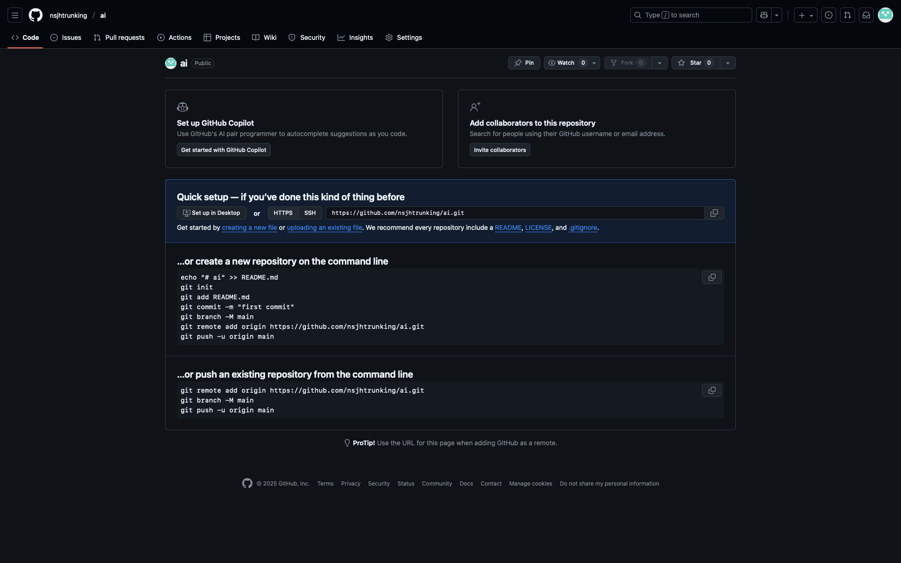
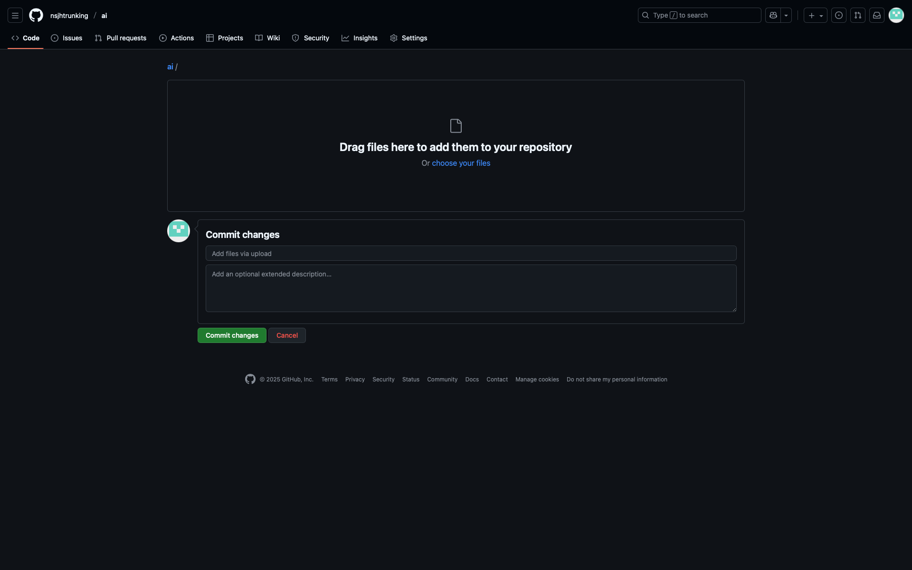
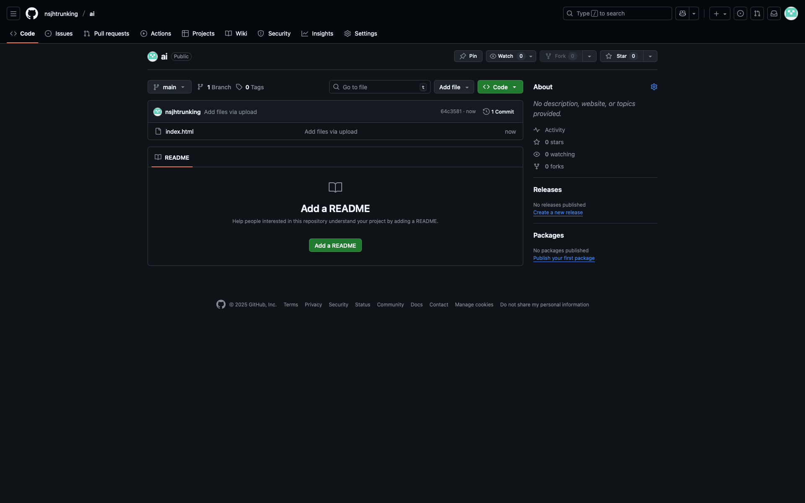
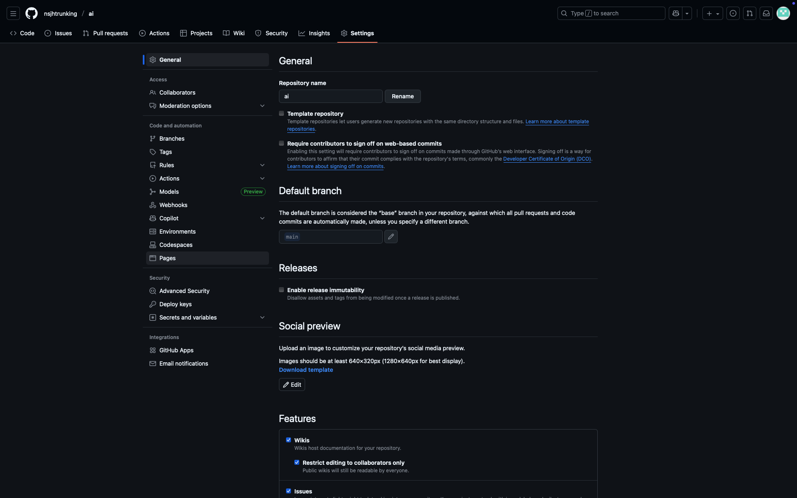
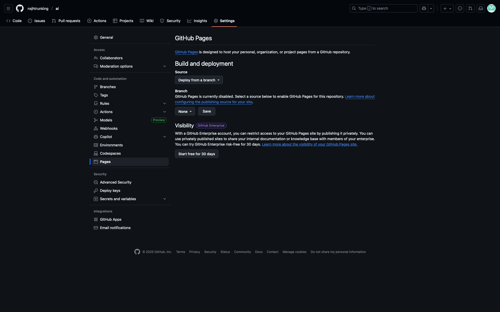
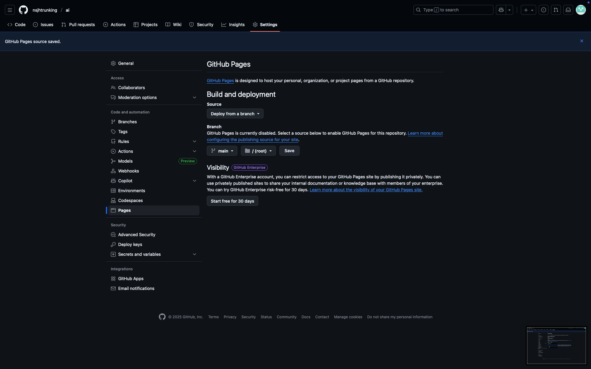

AiGameMaker
1. 今天任務
	1. md 格式撰寫
	2. 課綱-互動式網頁生成
	3. github部署、同步、協作
2. intro
   - 真正的學習是解決現實問題的歷程
   - 這世界很複雜，教師的任務是
	   - 降低問題維度給學生
	   - 淬鍊精華、要素、變因
1. 課堂使用互動性網頁應該要
	1. 快速，規則簡單不囉唆
	2. 能傳達重要概念，能提供補強課本沒有的概念或情境延伸
	3. 能引發更多好奇興趣，進而....
2. 如何用 Ai 來協助，需求是什麼？
	1. 序列化排列
	2. 配對、拼圖
	3. 腦力激盪
	4. 真實情境的降維模擬
	5. 加速學習 : 圖解化書摘，舉[意義地圖](https://chyijiunn.github.io/eduGame/games/drawSVG/meaningMap2.svg?fbclid=IwY2xjawObyyNleHRuA2FlbQIxMABicmlkETFUb1hjVGQwakQ2SnIyQkp3c3J0YwZhcHBfaWQQMjIyMDM5MTc4ODIwMDg5MgABHuuNxm-xkkaPyFxyD6jQG-siPIMR-xhWhKi5tgh28PyYYQsvGjJKtQltW389_aem_qv_vjfi6eAaDiSKDs1yUoQ)為例
3. 自己寫網頁於教學上意義
	1. 製作工具，利用工具，工具重複利用，透過歷程累積、修正概念、
		1. 數學[質因數分解](https://chyijiunn.github.io/eduGame/games/prime-city/)
		2. 化學[化學式平衡](https://chyijiunn.github.io/eduGame/games/chem-balance/)
		3. 國語[成語](https://chyijiunn.github.io/eduGame/games/chenyu/)
		4. 英語[字彙](https://chyijiunn.github.io/eduGame/games/word-search/)
		5. 科技
			1. [caseMaker](https://chyijiunn.github.io/eduGame/games/case-maker/)製作
			2. [光學研磨師](https://chyijiunn.github.io/eduGame/games/len-design/)模擬
			3. 小[向量圖](https://chyijiunn.github.io/eduGame/games/drawSVG/)製作
	2. 傳達概念
		1. [黑猩猩](https://chyijiunn.github.io/eduGame/games/ayumu-memory/)
		2. [認知衝突](https://chyijiunn.github.io/eduGame/games/color-stroop/)
	3. 從資料學習，設立階段性任務供學生逐步完成
		1. [CRISPR](https://chyijiunn.github.io/eduGame/games/crispr/)
		2. [糖尿病救星](https://chyijiunn.github.io/eduGame/games/cure-beta-cell/)
	4. 模擬數據以及情境
		1. [內分泌失調事件簿](https://chyijiunn.github.io/eduGame/games/endocrine-sys/)
		2. [無人機PID](https://chyijiunn.github.io/eduGame/games/drone-PID/)模擬
		3. [大富翁](https://chyijiunn.github.io/eduGame/games/sim-TW-stock/)
	5. 如何評鑑課程？
4. [Quarto](https://chyijiunn.github.io/eduGame/games/quarto-element/)
	1. 四連戰QUARTO 遊戲規則 內容物就是16個木頭 有以下幾8種特徵 高or矮、顏色深or淺、實心or空心、方形or圓形 遊戲規則是輪到你時 挑選一個任意木頭給對方 對方要把它放到4x4的格子內，若有某條線(直橫斜都可)皆具有同一特徵 例如：某一直線都是圓形，這樣就贏了！
	2. 利用這個桌遊的規則做一個化學元素符號的版本，需要有16種元素， 這些元素需符合 quarto 的棋子特性， 需要利用四個特性，每個特性可將16個分為兩組各八個， 盡可能讓16個元素特性排列出每個元素都有獨一無二的狀態，不要有彼此重複的特性如同原本遊戲的木頭設計， 分類的特徵儘量為中學生學到的範圍，找出這16個元素，並且將四個特徵列表厚載細分兩類也分出
5. 課綱淬鍊不容易文本呈現的內容：science class
	1. 物質與粒子
		1. [原子模型演化史](https://chyijiunn.github.io/eduGame/games/atom-model/)|原子不可見、電子軌道抽象|「原子演化互動時間軸」：用滑桿切換道耳頓 → 湯姆森 → 波耳 → 現代模型，顯示電子分布動畫
		2. 元素週期表與性質規律|元素週期性、族群趨勢|「互動週期表」：滑鼠移入顯示熔點、電負度、原子半徑的可視化曲線
		3. [物質三態](https://chyijiunn.github.io/eduGame/games/state-of-matter/)粒子運動|看不見的粒子與溫度關聯|「溫度控制模擬器」：調整溫度觀察固體、液體、氣體中分子運動速度與距離變化
		4. 混合物分離|看不見的粒子分類|「實驗室模擬」：選擇分離法（過濾、蒸餾、結晶）→ 觀察粒子分離動畫
	2. 能量、力與運動
		1. 能量轉換與守恆|看不見能量流動|「能量流向地圖」：模擬光合作用、電池放電、滑梯運動等能量轉換比例條
		2. 功與功率|功的概念難量化|「功率比較器」：拉不同重量與距離，觀察功與功率的變化
		3. 動能與位能互換|抽象的能量形式|「過山車模擬」：改變軌道高度與質量，看動能/位能條形圖變化
		4. 熱傳導、對流、輻射|三種熱傳遞機制不易觀察|「熱傳模式切換」：顯示三種熱傳途徑的粒子動畫
		5. 壓力與浮力|難以理解流體力|「水中浮沉實驗」：調整密度或體積，看浮力變化圖與受力箭頭
	3. 電與磁
		1. 電路電流與電阻|電流不可見|「電流可視化電路板」：拖放電池、燈泡與電阻，觀察電流流速與亮度
		2. 電磁感應|難以觀察磁場變化|「線圈與磁鐵互動」：移動磁鐵或改變圈數，看感應電流方向（含右手定則動畫）
		3. 電磁力與馬達原理|三維力向量概念抽象|「簡易馬達模擬」：可旋轉觀察導線受力與磁場方向
	4. 地球與宇宙
		1. 日月運行與食現象|三維空間關係|「日地月系統3D模型」：拖曳觀察日食、月食、月相|
		2. 板塊運動與造山|地球內部動態|「地球構造交互模型」：拖曳板塊方向，觀察火山、地震、山脈生成|
		3. [天氣](https://chyijiunn.github.io/eduGame/games/cloud-maker/)與[氣團](https://chyijiunn.github.io/eduGame/games/airmass/)形成|氣壓差與風的生成抽象|「氣壓模擬箱」：調整氣溫與濕度，看氣流箭頭與鋒面生成動畫|
		4. 海流與潮汐|難以觀察的大尺度運動|「地球海流地圖」：滑動時間軸觀看季節性洋流變化與潮汐動畫|
		5. 全球暖化與[氣候](https://chyijiunn.github.io/eduGame/games/atmospheric-circulation/)變遷|多因素系統交互|「地球能量平衡模擬器」：調整CO₂濃度、雲量、冰面積，觀察全球溫度趨勢圖|
	5. 生物構造與生命現象
		1. 細胞構造與分裂|無法肉眼觀察|「細胞分裂動畫模擬」：滑桿控制分裂階段、觀察染色體變化
		2. 酵素反應速率|分子層次難理解|「酵素反應速率模擬」：調整溫度、pH、濃度，觀察反應曲線
		3. 光合作用與呼吸作用|能量轉換抽象|「葉綠體模擬」：光照強度與CO₂濃度改變下的氧氣產量圖
		4. 人體[恆定](https://chyijiunn.github.io/eduGame/games/endocrine-sys/)調節|多系統交互複雜|「人體恆定控制中心」：模擬體溫上升/下降→ 神經與內分泌回饋機制動態圖
	6. 生態與永續
		1. 生態系[能量](https://chyijiunn.github.io/eduGame/games/sketch_forest/)流動|能量路徑不直觀|「食物鏈能量流」：點選生物，顯示能量遞減條形動畫
		2. 物質循環（碳循環、水循環）|多層次跨界現象|「碳循環互動地圖」：模擬CO₂在人類活動、植物、海洋間流動
		3. 永續能源與社會影響|技術—環境連結抽象|「能源選擇模擬」：比較太陽能、核能、化石燃料在成本、排放、產能的圖表互動介面
6. [AntEmpire](https://chyijiunn.github.io/eduGame/games/ant-empire/)
	1. 構思大
		1. 從論文開始
			1. 請整理費洛蒙相關功能並列表呈現
			2. 依功能形態分種類、分子式、功能、物種
		2. 交互作用
			1. 二級
			2. 三級
		3. 聚斂再聚斂
			1. 模式動物
			2. 功能調整：天氣系統增加或簡化
			3. 介面整併及簡化
	2. 隨便給一句話
		1. 再增加功能
		2. 注意 token 量
7. 遊戲化要素-機制
	1. 正向條件目的
		1. 摧毀 / 建構
		2. 殺死星球上的生物 / 災難來了[拯救星球](https://chyijiunn.github.io/eduGame/games/solar-rescue/)生物
		3. 用放大鏡的[焦點](https://chyijiunn.github.io/eduGame/games/roach-zoom/)燒死螞蟻 / 用放大鏡焦段幫忙縮小或放大生物
	2. 激勵系統
		1. 點數 / 時間
		2. 合成器 / 升級 / 關卡條件
	3. 假想敵
		1. 看起來不怎麼樣，有存在感也很棒的敵人
		2. 虛擬條件敵人：[資源](https://chyijiunn.github.io/eduGame/games/lymph-sys/)、時間、點數
8. 設計一個消化系統互動網頁，可用瀏覽器打開的單一 HTML
	1. a 拼完後，食物通過
		1. 目標
			1. 設計一個可拖曳的人體消化器官介面，每個消化器官都可拖曳
			2. 拖曳到正確位置時，可貼合物件
		2. 回饋機制
			1. 完成消化系統後，消化吸收的養分稱為能量值
			2. 每公克醣類、蛋白質、脂質分別得到 4 ,4 ,9 分
		3. 提示系統
		4. 介面設定
			1. 主畫面可滾輪放大縮小
			2. 主畫面色調為黑色，佔畫面三分之二，畫面中央為主要互動空間，開始的時候為人體，藍色，透明度 0.5
			3. 右方為互動面板欄位，佔畫面三分之一，
				1. 右上角為分數系統
				2. 中間為可拖拉的器官分散，器官尚未排列前會慢慢地隨意漂動，高度佔三分之二
				3. 下方為為可拖拉的食物分散
				4. 物件可拖拉到主畫面
		5. 物件與關聯
			1. 物件：人體和器官都要 svg 繪圖，器官輪廓外型如上傳圖檔、注意比例，器官要對應人體正確大小
				1. 消化管：粉紅色，透明度0.6，口腔、咽、食道、胃、小腸、大腸，器官位置在人體有透明度 0.3 的粉紅色虛線引導放置，若接合點正確則可讓食物順利通過。
				2. 消化腺：黃色，透明度0.8，唾腺、肝臟(綠色膽囊附著內部)、胰臟。食物通過腺體的時候會自動分泌出消化液，消化的規則根據真實狀況來分泌消化液，消化液除了膽汁以外都用黃色點點來呈現
				3. 食物
					1. 包含各種不同比例的糖類、蛋白質、脂質的各種食物
					2. 食物移動路徑為沿食物管前進
					3. 食物通過正確位置會被消化成碎片、粉末、溶解狀態
					4. 被分解的食物會根據分解的比例增加能量值
			2. 關聯，包含各種養分經過腺體時被分解的狀況
				1. 醣類
					1. 唾腺
					2. 胰臟
					3. 腸腺
				2. 蛋白質
					1. 胃腺
					2. 胰臟
					3. 腸腺
				3. 脂質
					1. 膽汁
					2. 胰臟
	2. b 設計一個消化系統拼圖，將上傳的 svg 檔拆開變成不同物件，按照檔案的顏色分配，物件分成
		1. 背景圖：為人體背景圖，不能移動
		2. 消化管：食物會通過的範圍，物件中有個 food_path，是紅色虛線標示(不在介面顯示，僅為程式背景作業路徑)，食物會沿著虛線移動，直至終點，檔案中連接的消化管前後會有重疊，設定物件若有重疊的範圍即符合拼圖規則，
			1. 口腔 mouth
			2. 咽 pharynx
			3. 食道 esophagus
			4. 胃 stomach
			5. 小腸 smallint
			6. 大腸 largeint
		3. 消化腺：
			1. 肝臟 liver 和 膽囊 gallbladder 合併 
			2. 胰臟 pancreas
		4. 介面：
			1. 右邊欄位佔畫面寬度三分之一，
				1. 三分之二的高度都放上面的物件，物件尚未被選擇時會上下左右輕微抖動，物件可被拖拉到中間人體圖位置，移出後右邊就沒有這個器官，其餘器官會往上靠齊
			2. 左邊欄位佔畫面寬度三分之二，放人體背景圖
			3. 在所有器官被移出右方欄位，且放對位置(在人體背景圖範圍內，且相對位置與重疊處正確，可容許誤差)的時候，會新增一個按鈕稱作「餵食」，按下後食物會沿著 food_path 移動，移動經過口腔內、胃內、肝臟附近、胰臟附近、小腸內時，播放這些器官分泌黃色點點出來的小動畫
9. prompt
	1. 幫我建立互動網頁，需要包含 css , java , 包成單個 html 檔，可電腦瀏覽器或手機使用，內容是 
		1. OO...
		2. XX...
	2. 頁面支援電腦瀏覽器及手機平板，電腦瀏覽器支援滑鼠滾輪縮放，單點左鍵拖曳、手機平板支援雙指觸控拖曳、縮放以及單指點選
	3. 不需要呈現出原始碼，提供下載檔案連結即可，生成檔案依照修改版本累計修版號，第一個稱為 v0.1，根據 0.1 修改的稱為0.11 以此類推下去
10. 使用者資料
	1. GA4 / [Plausible](https://plausible.io)
	2. 註冊網頁

1. 入口網頁規劃，[範例](/demo.html)
	1. 幫我利用 css , java ,寫一個 html 的入口網頁
	2. 以向量圖片形式提供網站連結，並提供搜尋、設定不同類別標籤
	3. 色系以 OO 色為主色調，搭配 OO 和白色

# 作業
1. 完成後按發佈再分享
2. padlet 可以有縮圖
3. 有時候沒成功因為按到文件了，要按程式碼喲
# process
1. 網站架構
	1. index
	2. css
	3. folder
	4. asset
2. 先改模板
	1. 標籤類別
	2. 每個頁面內部
	3. 圖 [svg](https://chyijiunn.github.io/eduGame/games/drawSVG/)
		1. 基本圖形
		2. 圖層概念
		3. 群組概念
3. 寫 [md](file:///Users/trunking/Documents/GitHub/eduGame/games/markdown/) 說明以及要求
4. 生成一個網頁
5. github desktop
6. GA
# Git pages
1. 上傳

1. 拖拉 index

1. 按齒輪

1. 進入 General

1. 的 pages

1. branch

1. 或者看[影片](https://youtube.com/shorts/IALMPxmr_O8)